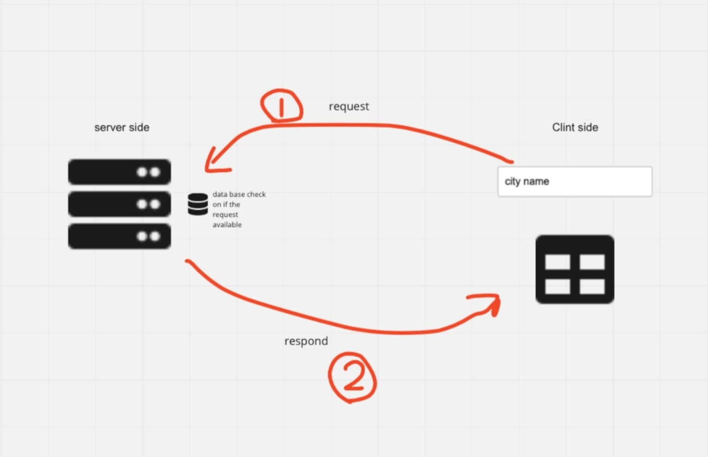

# City Explorer

**Author**: Ahmed Marwan Abu-Ali
**Version**: 1.2

## Overview
It simply will search for any city that the user will enter and show some information about it 

## Getting Started
1) Build React App 
2) Connect it with API's
3) Design a pretty UI
4) Test Everything toghter

## Architecture
1) REACT
2) API's
3) REACT BOOTSTRAP 

## Change Log
ALL COMPONENT WERE IMPLEMENTED RIGHT FROM THE FIRST TIME BY 8/4/2022 7:25 AM,

## Credit and Collaborations
Eyad Mansour Helped Me 

Name of feature:API's
Estimate of time needed to complete: 2 hours

Start time: 5:30 PM

Finish time: 9:30 PM

Actual time needed to complete: 4 hours